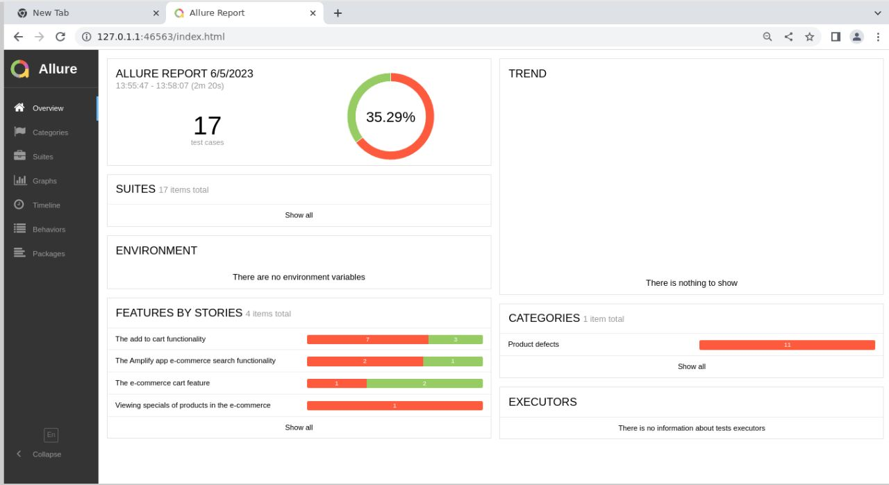

# QA Automation Project

## Project Definition

The QA project focused on addressing numerous bugs in an e-commerce website. It involved comprehensive testing procedures to identify bugs across various aspects of the site, including functionality and usability. The bugs were documented with detailed descriptions, reproducible steps, and severity and priority ratings. A comprehensive report was created, providing insights into the bugs and recommendations for resolution. A defect log was maintained to track the lifecycle of each bug, ensuring transparency and accountability. The project aimed to improve the website's quality and user experience through effective bug tracking and resolution.

## Tools Used

- Python - https://www.python.org/
- Behave - https://behave.readthedocs.io/en/latest/
- Github - https://github.com/feelthedimez/grocery_assessment
- Allure Reporting w/ Behave - https://docs.qameta.io/allure/#_behave
- Chrome and its driver

## How to get started

### Prerequisites

1. Python
2. Java
3. Wifi Connection

### Installation

Assuming that you have Python, Java and you have a stable connection. Run the following commands in the project **`root directory`**:

a. Create a virtual environment

```bash
pip install virtualenv 
virtualenv .venv
# if the above fails, then run:
python -m virtualenv
```

b. Activate the virtual environment

It depends which OS you're using and what type of terminal you're running python on. 

```bash
# for linux & mac bash/zsh
source .venv/bin/activate
# for windows bash
source .venv/Scripts/activate
```

For more information, please visit: https://www.infoworld.com/article/3239675/virtualenv-and-venv-python-virtual-environments-explained.html

c. Then, install all this projects packages:

```bash
pip install -r requirements.txt
```

## Config file with all the username and passwords
> If you're reviewing this project, please check the email. It will contain a config file with the password and username and the auth url. I can't push it to git for security reason.

Go to: `root/configs/creds.ini` and replace those values with the data provided in the email.


## Execution

Assuming that you have everything installed correctly. Run the following command to execute all the results:

```bash
behave -f allure_behave.formatter:AllureFormatter -o reports/ features/web
```

This is going to generate the results inside a newly created folder called `reports`.

### Generate a clean report

Now, we're on the last step. We need to install `allure`.

Linux/MacOS:

1. Go to Github: (https://github.com/allure-framework/allure2/releases)
2. Download the `.tgz` file
3. Then run the following commands:

    ```bash
    sudo tar -zxvf allure-2.22.1.tgz -C /opt/
    sudo ln -s /opt/allure-2.22.1/bin/allure /usr/bin/allure
    rm allure-2.22.1.tgz
    ```

Windows:

1. Go to Github: (https://github.com/allure-framework/allure2/releases)
2. Download the `.zip` file
3. Then, unzip it.
4. Copy folder `allure-2.22.1` to the `C:\Program Files\` drive in windows
5. Then go to `Windows Environmental Varibales`
6. Then inside `Path System Variable`, add: `C:\Program Files\allure-2.20.1\bin` 
7. Exit and then click on apply.

Now I will assume that everything is working. Run the following commands:

```bash
allure generate --clean reports/
allure open
```

Then you should see a screenshot like this:



Then yes, that's the final results.